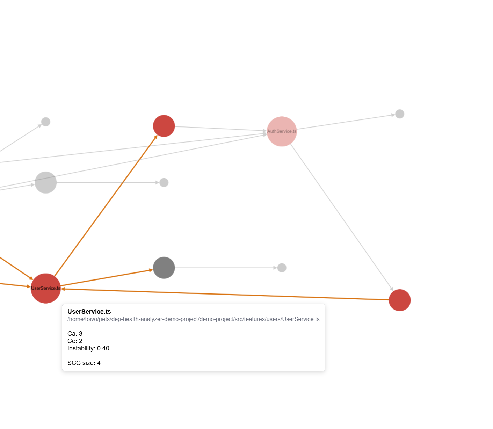
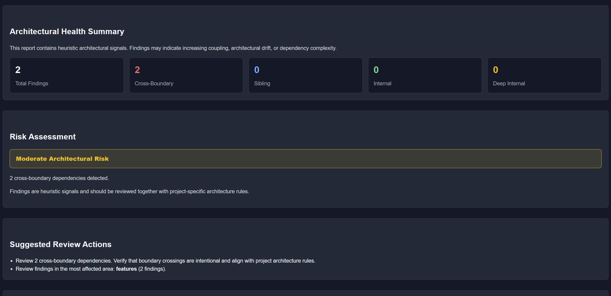
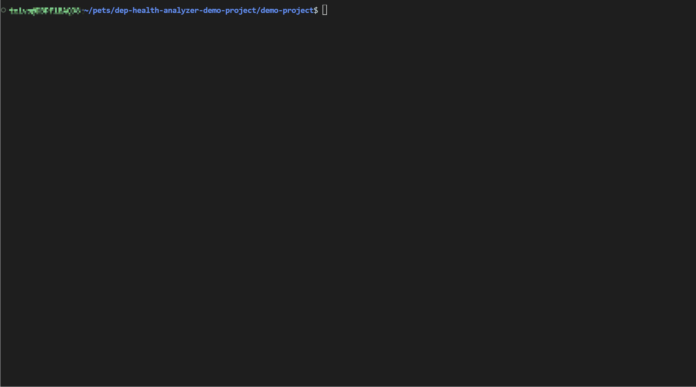

# dep-health-analyzer

_Architectural awareness, not architectural enforcement._

Keep track of your project's dependency health.

As projects grow, dependency structure becomes harder to understand.

New imports are added.
Modules become more connected.
Cycles appear.
Architecture slowly drifts away from its original shape.

Most of these changes happen gradually and often go unnoticed during code review.

dep-health-analyzer helps make these changes visible.

---

## Questions it helps answer

### What changed?

Compare dependency structure between commits, branches, or releases.

### Should I take a closer look?

Spot new cycles and structural dependency changes that may deserve additional review.

### What parts of the project were affected?

See where new dependencies appeared and how they relate to the existing structure.

### When did this happen?

Track architectural changes across Git history and understand how dependency structure evolved over time.

---

## What it does

### Dependency Cycle Detection

Build a dependency graph and detect strongly connected components (SCCs).

Explore:

- dependency cycles
- module stability metrics
- coupling relationships
- architectural hotspots

Available modes:

- full
- compact
- html

### Regression Analysis

Compare the current dependency graph against a previous Git revision.

Identify newly introduced:

- cross-boundary dependencies
- deep-internal dependencies
- internal dependencies
- sibling dependencies

Each finding includes contextual information explaining why the relationship was classified that way.

Available modes:

- full
- compact
- html

### Interactive HTML Reports

Generate interactive reports designed for architectural exploration.

Reports provide:

- dependency graph visualization
- SCC highlighting
- architectural metrics
- dependency insights
- regression summaries
- risk assessment information

---

### Cycle Detection

Explore dependency graphs, identify SCC clusters, and inspect architectural metrics interactively.



_Cycles are highlighted automatically. Hover over modules to inspect coupling metrics and instability._

### Regression Analysis

Compare dependency structure between revisions and review newly introduced architectural signals.



_Reports summarize structural findings, assess potential risk, and suggest areas for review._

### See how architectural changes become visible.



## Quick Start

Install the package:

```bash
npm install -D dep-health-analyzer
```

Generate a default configuration:

```bash
npx dep-health-analyzer --init
```

Detect dependency cycles:

```bash
npx dep-health-analyzer cycles
```

Compare the current revision against the previous commit:

```bash
npx dep-health-analyzer regression --baseline HEAD~1
```

Generate interactive HTML reports:

```bash
npx dep-health-analyzer cycles --mode html

npx dep-health-analyzer regression --mode html
```

## CI/CD Integration

dep-health-analyzer can be used as a quality gate in CI pipelines.

Configure severity levels and fail builds when architectural signals exceed the thresholds accepted by your team.

Regression analysis helps surface structural changes during code review, while cycle detection helps monitor long-term dependency health.
