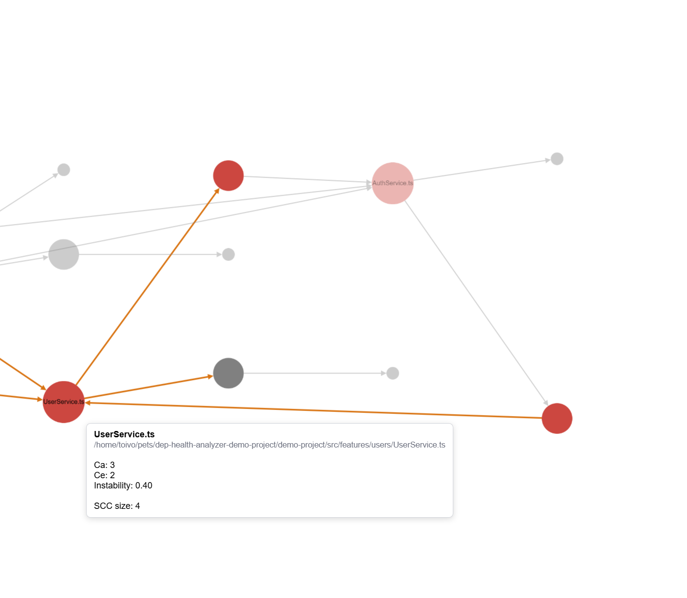
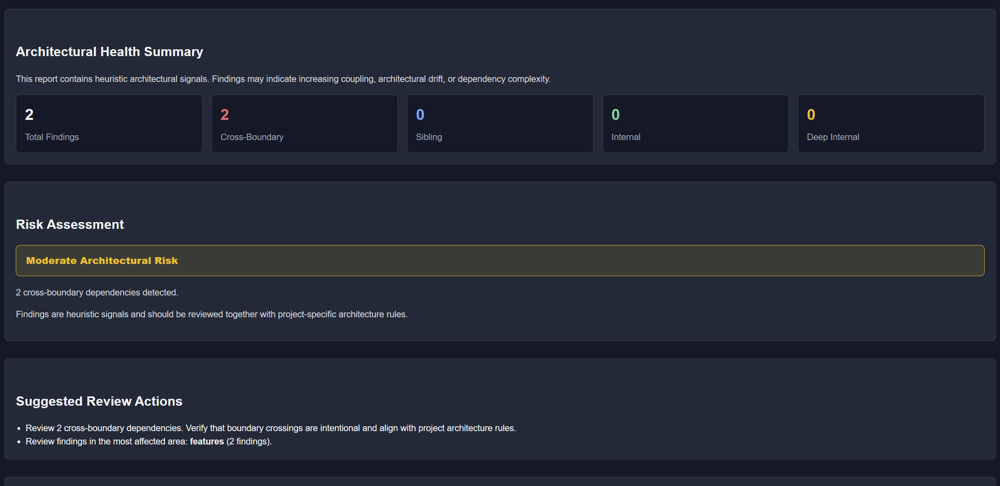
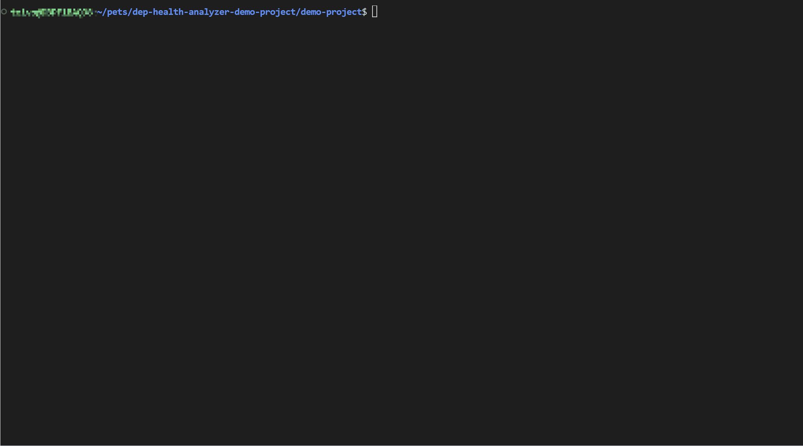

# dep-health-analyzer

_Architectural awareness, not architectural enforcement._

Keep track of your project's dependency health.

As projects grow, dependency structure becomes harder to understand.

New imports are added.
Modules become more connected.
Cycles appear.
Architecture slowly drifts away from its original shape.

Most of these changes happen gradually and often go unnoticed during code review.

**dep-health-analyzer** helps make these changes visible.

---

# Questions it helps answer

## What changed?

Compare dependency structure between commits, branches, or releases.

## Should I take a closer look?

Spot new cycles and structural dependency changes that may deserve additional review.

## What parts of the project were affected?

See where new dependencies appeared and how they relate to the existing structure.

## When did this happen?

Track architectural changes across Git history and understand how dependency structure evolved over time.

---

# What it does

## Dependency Cycle Detection

Build a dependency graph and detect strongly connected components (SCCs).

Explore:

- dependency cycles
- module stability metrics
- coupling relationships
- architectural hotspots

Available modes:

- full
- compact
- html

---

## Import Resolution

Dependency graphs are built by analyzing `import` / `export` declarations (ES module syntax).

TypeScript path aliases are supported, including `tsconfig.json` configurations that use `extends`.

CommonJS `require()` and dynamic `import()` are not analyzed yet.

---

## Regression Analysis

Compare the current dependency graph against a previous Git revision.

Identify newly introduced:

- cross-boundary dependencies
- deep-internal dependencies
- internal dependencies
- sibling dependencies

Each finding includes contextual information explaining why the relationship was classified that way.

Regression rules can be adjusted per project area using scopes. Scopes allow overriding severity levels and thresholds, or ignoring findings entirely, for specific paths (for example, composition roots, infrastructure code, or reporting layers).

See [Configuration Reference](docs/CONFIGURATION.md) for every option, including scopes, severity, thresholds, and AI settings, with examples.

Available modes:

- full
- compact
- html

---

## History Analysis (Experimental)

Walk a range of Git history and see how regression findings evolved over time, instead of comparing just two revisions.

Samples a fixed number of commits along the first-parent chain (the mainline, skipping over merged branch commits) between a baseline and the current revision, then runs the same regression analysis at each sampled point using one of two comparison strategies:

- **incremental** — each point compared against the previous sampled point, showing risk introduced within that window of history
- **cumulative** — each point compared against the first sampled point, showing total drift accumulated since the baseline
- **both** — reports both series side by side

Every mode includes a **Trend Summary** — a classification (stabilizing / worsening / volatile / stable) plus any detected spikes, so the raw per-point numbers don't have to be interpreted by eye.

See [Configuration Reference](docs/CONFIGURATION.md#history-analysis) for every option, with examples.

Available modes:

- full
- compact
- html — generates an interactive trend chart, alongside a summary table for every sampled commit

---

## AI Summaries (Experimental)

Generate concise, human-readable summaries of `regression` or `history` analysis using a local Large Language Model (LLM) running via Ollama — pass `--ai` to either command. Both share the same `features.regression.ai` configuration.

AI summaries are generated exclusively from the observations produced by dep-health-analyzer.

The model does **not** inspect your source code directly.

No source code is sent to the model.

Supported features:

- local execution through Ollama
- configurable model
- configurable host
- configurable language
- multilingual summaries
- architecture-aware explanations based only on detected observations

Before generating a summary, dep-health-analyzer automatically verifies that:

- Ollama is installed
- the Ollama server is running
- the configured model is available

### AI Glossary

AI summaries may use the following terms:

| Term                         | Description                                                                                    |
| ---------------------------- | ---------------------------------------------------------------------------------------------- |
| **Hotspot**                  | File with the largest number of newly introduced dependencies.                                 |
| **Connected areas**          | Project areas connected by newly introduced dependencies.                                      |
| **Deep-internal dependency** | Dependency that traverses deeply into another module instead of using its public entry points. |
| **Trend classification**     | (`history` only) Stabilizing, worsening, volatile, or stable — see [History Analysis](#history-analysis-experimental). |
| **Spike**                    | (`history` only) A sampled point with unusually high risk compared to the rest of the range.   |

These terms describe the analysis itself and are independent of the analyzed project.

---

## Interactive HTML Reports

Generate interactive reports designed for architectural exploration.

Reports provide:

- dependency graph visualization
- SCC highlighting
- architectural metrics
- dependency insights
- regression summaries
- risk assessment information (see [Risk Assessment](docs/CONFIGURATION.md#risk-assessment-html-report) for how it's calculated)
- architectural risk trend charts across sampled Git history

---

# Cycle Detection

Explore dependency graphs, identify SCC clusters, and inspect architectural metrics interactively.



_Cycles are highlighted automatically. Hover over modules to inspect coupling metrics and instability._

---

# Regression Analysis

Compare dependency structure between revisions and review newly introduced architectural signals.



_Reports summarize structural findings, assess potential risk, and suggest areas for review._

---

# See how architectural changes become visible



---

# Quick Start

**Requirements:** Node.js 22+ (see `.nvmrc`).

Install the package:

```bash
npm install -D dep-health-analyzer
```

Generate a default configuration:

```bash
npx dep-health-analyzer --init
```

Detect dependency cycles:

```bash
npx dep-health-analyzer cycles
```

Compare the current revision against the previous commit:

```bash
npx dep-health-analyzer regression --baseline HEAD~1
```

See how architectural risk evolved over the last 50 commits:

```bash
npx dep-health-analyzer history --baseline HEAD~50 --points 10
```

Generate interactive HTML reports:

```bash
npx dep-health-analyzer cycles --mode html

npx dep-health-analyzer regression --mode html
```

Generate an AI summary:

```bash
npx dep-health-analyzer regression --ai

npx dep-health-analyzer history --ai
```

---

# CI/CD Integration

dep-health-analyzer can be used as a quality gate in CI pipelines.

Configure severity levels and fail builds when architectural signals exceed the thresholds accepted by your team.

Regression analysis helps surface structural changes during code review, cycle detection helps monitor long-term dependency health, and history analysis helps spot when architectural drift crept in across a range of commits.

**`regression` and `history` both need full Git history**, not just the latest commit — they compare the current state against an older revision by checking it out into a temporary `git worktree`. Most CI providers do a shallow clone by default (depth 1), which only has the latest commit and breaks both commands. On GitHub Actions, set `fetch-depth: 0` on the checkout step:

```yaml
name: Architecture Check

on: pull_request

jobs:
  dep-health:
    runs-on: ubuntu-latest
    steps:
      - uses: actions/checkout@v4
        with:
          fetch-depth: 0 # required - regression/history need full history, not a shallow clone

      - uses: actions/setup-node@v4
        with:
          node-version: 22

      - run: npm ci

      - run: npx dep-health-analyzer regression --baseline origin/main --mode compact

      - run: npx dep-health-analyzer history --baseline HEAD~50 --points 10 --mode compact
```

Both commands exit with code `1` when a finding meets the configured `failOn` severity, which fails the job the same way a failing test would.
